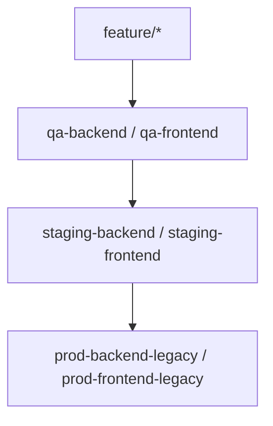

# 🧭 Interview Agent — Environment & Deployment Reference

## 🔹 Overview
This document outlines the **branching, environment, and deployment structure** for the Interview Agent platform.  
It ensures QA, Staging, and Production environments remain synchronized and predictable during active development.

---

## 🧱 Repositories

| Repo | Purpose | Primary Branches |
|------|----------|------------------|
| **interview-agent-backend** | Express-based API, Supabase integration, Tavus + OpenAI logic | `qa-backend`, `staging-backend`, `prod-backend-legacy` |
| **interview-agent-frontend** | React/Vite-based dashboard + candidate UI | `qa-frontend`, `staging-frontend`, `prod-frontend-legacy` |

---

## ☁️ Render Services

| Render Service | Type | Connected Branch | Environment Purpose |
|----------------|------|------------------|----------------------|
| `ia-backend-qa` | Web Service | `qa-backend` | Dev/QA testing builds |
| `ia-backend-staging` | Web Service | `staging-backend` | Pre-production validation (UAT) |
| `ia-backend-prod` | Web Service | `prod-backend-legacy` | Live Production backend |
| `ia-frontend-qa` | Static Site | `qa-frontend` | Dev/QA frontend |
| `ia-frontend-staging` | Static Site | `staging-frontend` | Pre-production frontend |
| `ia-frontend-prod` | Static Site | `prod-frontend-legacy` | Live Production frontend |

---

## 🧭 Domain Map

| Domain | Destination | Purpose |
|--------|--------------|----------|
| **https://www.alphasourceai.com** | Wix (temporary marketing site) | Public marketing pages |
| **https://interviews.alphasourceai.com** | Render → `ia-backend-prod` | Branded interview access subdomain |
| **https://ia-frontend-prod.onrender.com** | Frontend Production | User portal (Prod) |
| **https://ia-frontend-staging.onrender.com** | Frontend Staging | Pre-prod verification |
| **https://ia-frontend-qa.onrender.com** | Frontend QA | Developer test builds |

---

## 🧩 Branch & Promotion Flow



### Rules
- **New features** → always start from `qa-*`.
- **QA** → for dev validation.
- **Staging** → for pre-prod testing & UAT.
- **Prod** → final production release only via merges from staging.

---

## ⚙️ Promotion Commands

### Promote QA → Staging
```bash
git checkout staging-backend
git merge qa-backend --no-ff -m "Promote QA → Staging"
git push origin staging-backend

git checkout staging-frontend
git merge qa-frontend --no-ff -m "Promote QA → Staging"
git push origin staging-frontend
```

### Promote Staging → Prod
```bash
git checkout prod-backend-legacy
git merge staging-backend --no-ff -m "Promote Staging → Prod"
git push origin prod-backend-legacy

git checkout prod-frontend-legacy
git merge staging-frontend --no-ff -m "Promote Staging → Prod"
git push origin prod-frontend-legacy
```

---

## 🧾 Environment Variables

| Environment | File / Render Service | Notes |
|--------------|----------------------|--------|
| **QA** | `.env.qa` or Render “QA” | Mirrors prod but with test Supabase + Tavus keys |
| **Staging** | `.env.staging` | Uses staging Supabase + PDFMonkey templates |
| **Prod** | `.env.prod` | Live connections and API keys |

---

## 🔒 GitHub Branch Protection

| Branch | Protection |
|---------|-------------|
| `prod-backend-legacy` | PRs only (no direct pushes) |
| `prod-frontend-legacy` | PRs only (no direct pushes) |
| `staging-*` | Optional review for merges |
| `qa-*` | Open for development |

---

## 🧪 Verification Flow

| Step | Verification | Criteria |
|------|---------------|-----------|
| 1 | QA Deploy | Builds, API routes, role creation |
| 2 | Staging Deploy | Token flow, link generation, UI validation |
| 3 | Prod Deploy | Cam/mic prompts, email triggers, PDF generation |

---

## 🧰 Local Development Layout

```
/interview-agent-backend
  ├── qa/
  ├── staging/
  └── prod/
  
/interview-agent-frontend
  ├── qa/
  ├── staging/
  └── prod/
```

Use these local directories for testing before pushing to the appropriate branch.

---

## 🚀 Promotion Summary

| Flow | Source → Destination | Trigger |
|------|----------------------|----------|
| **Dev → QA** | Local → `qa-*` | Developer push |
| **QA → Staging** | `qa-*` → `staging-*` | Internal validation complete |
| **Staging → Prod** | `staging-*` → `prod-*-legacy` | MVP verified and approved |

---

## 🧭 Environment Sync & Promotion Guide

### 1. Database Sync (Prod → QA / Staging)
To ensure data parity across environments:
```bash
# Dump production database
pg_dump --format=custom --compress=9 --no-owner --no-privileges \
  --exclude-schema='pg_*' --exclude-schema='information_schema' \
  --dbname="$PROD_URL" --file=prod_full_$(date +%Y%m%d_%H%M).dump

# Restore to QA
pg_restore --clean --if-exists --no-owner --no-privileges \
  --dbname="$QA_URL" prod_full_YYYYMMDD_HHMM.dump

# Restore to Staging
pg_restore --clean --if-exists --no-owner --no-privileges \
  --dbname="$STG_URL" prod_full_YYYYMMDD_HHMM.dump
```

✅ *Notes:*
- `PROD_URL`, `QA_URL`, and `STG_URL` should point to their Supabase Postgres connection strings.
- The source (Prod) database remains read-only during this process.
- QA and Staging are safely overwritten.

---

### 2. Storage Sync (Prod → QA / Staging)
Used to mirror Supabase Storage buckets.

```bash
DRY_RUN=1 node storage-mirror.js --from=prod --to=qa
DRY_RUN=1 node storage-mirror.js --from=prod --to=stg

# When verified
DRY_RUN=0 node storage-mirror.js --from=prod --to=qa
DRY_RUN=0 node storage-mirror.js --from=prod --to=stg
```

✅ *Notes:*
- The `.env` file should contain `PROD_URL`, `QA_URL`, `STG_URL` and their corresponding `SERVICE_KEY`s.
- The script reads from Prod only; it never modifies or deletes anything there.
- Use DRY_RUN first to preview changes.

---

### 3. Verification Checklist
| Step | Task | Expected Result |
|------|------|-----------------|
| ✅ 1 | Confirm DB schemas/tables match | `\dt` and `\d` show identical structure |
| ✅ 2 | Check data counts | Counts for key tables match Prod |
| ✅ 3 | Confirm storage buckets | Bucket lists identical in all environments |
| ✅ 4 | Deploy QA/Staging | App loads without data errors |
| ✅ 5 | Promote to Prod | All validation steps pass |

---

### 4. Safety Practices
- Never run `pg_restore` with reversed targets (QA → Prod).
- Always use a new dump file for each sync event.
- Perform syncs during low activity windows.
- After sync, run basic API checks for roles, candidates, and reports.

